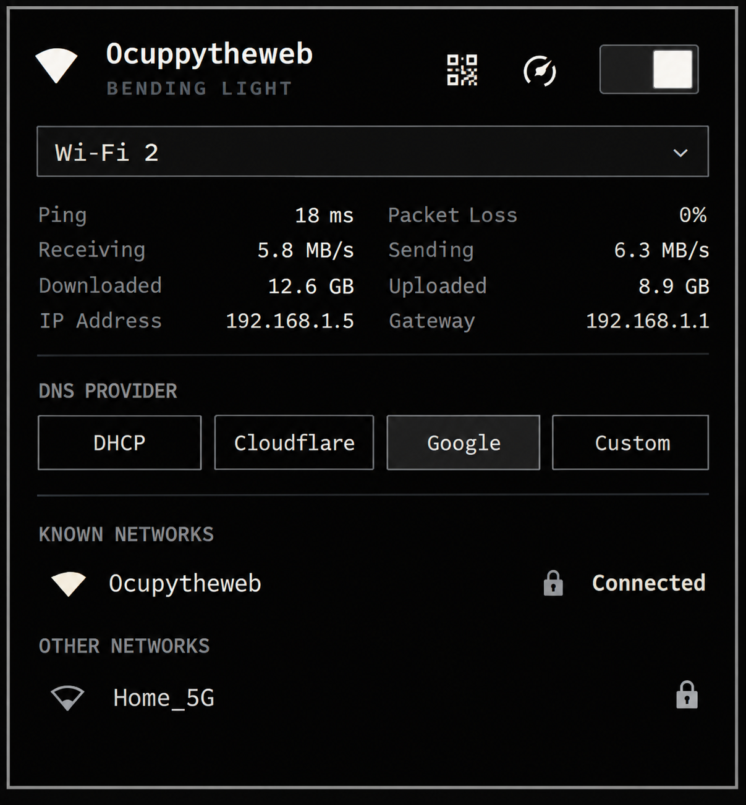
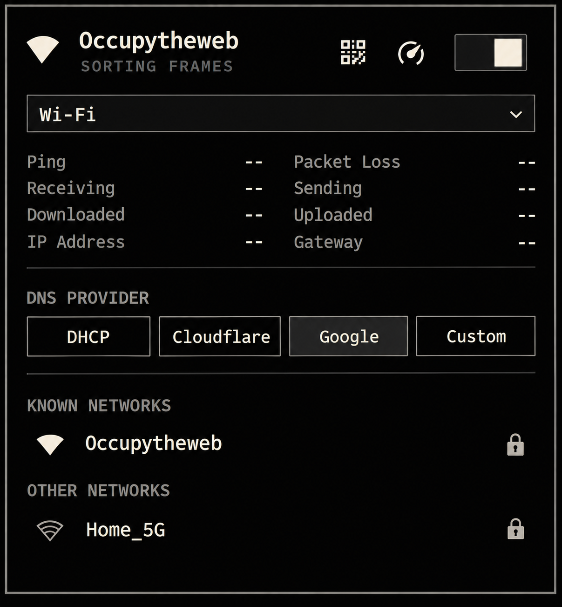

# elliot-network-plugin

Omarchy bar-widget plugin for network status: a Wi-Fi network list with
per-adapter connection state, stats, and controls — built for machines
with more than one Wi-Fi radio.

## Screenshots

| Connected radio | Idle radio |
| --- | --- |
|  |  |

Stats are per-adapter: viewing the idle radio reads `--` while the other
radio carries the connection.

## Features

- Wi-Fi network list with connect / disconnect / forget, plus inline
  passphrase and 802.1X enterprise prompts.
- Adapter switcher dropdown when 2+ Wi-Fi radios are present. Labels
  come from interface names (USB-path names like `wlp0s20f0u1` →
  "Wi-Fi 2"); colliding labels fall back to numbering so every radio
  stays selectable.
- The `Connected` badge follows the default route: when two radios are
  joined to the same SSID, only the one carrying traffic shows it — the
  idle radio lists the SSID as a normal known network, and clicking it
  connects/switches instead of disconnecting.
- Header and bar icon reflect the live connection on **any** radio, not
  just the adapter being viewed.
- Connection stats (IP, gateway, ping, throughput) are gated to the
  selected adapter — an idle radio reads `--` instead of showing the
  other adapter's numbers. Ethernet and VPN routes stay global.
- View-only browsing: viewing an idle adapter suppresses its
  NetworkManager autoconnect so a panel-triggered scan can't join its
  saved networks. Suppression is restored on switch-away, panel close,
  explicit connect, or if the radio comes up by any other means.
- Single-adapter policy: connecting on one radio disconnects the other
  live radios (only radios that are actually connected are dropped, so
  an idle radio's autoconnect is never poisoned).
- On open, the dropdown snaps to the radio carrying the connection.
- In-flight connect / disconnect / forget actions are bound to the
  radio that started them — a same-named network on the viewed adapter
  can't complete or fail another radio's action.
- Row states render as right-edge text: `Connected` · `Connecting…` ·
  `Disconnecting…` · `Working…` · `Retry`.
- Keyboard navigation (j/k/Enter/Esc), Wi-Fi band selection
  (2.4/5/6 GHz), DNS provider pills, QR share, speed test.
- VPN default routes (tun/tap/wg*/mullvad/proton/tailscale/…) are
  detected by interface name and shown as "SSID (VPN)" — Ethernet,
  bridges, bonds and VLANs are never mislabeled.
- IPC target `omarchy.network`.

## Requirements

- Omarchy (Quickshell shell)

## Install (recommended)

```bash
omarchy plugin add https://github.com/elliotalien/elliot-network-plugin.git --enable
```

Validate and reload:

```bash
omarchy plugin validate ~/.config/omarchy/plugins/elliot.network
omarchy restart shell
```

## Install (manual)

```bash
git clone https://github.com/elliotalien/elliot-network-plugin.git ~/.config/omarchy/plugins/elliot.network
omarchy plugin enable elliot.network
omarchy restart shell
```

Via SSH (if you use SSH keys):

```bash
git clone git@github.com:elliotalien/elliot-network-plugin.git ~/.config/omarchy/plugins/elliot.network
```

## Update

```bash
omarchy plugin update elliot.network
omarchy restart shell
```

## Uninstall

Disable it (keeps the files, removes the widget from the bar):

```bash
omarchy plugin disable elliot.network
omarchy restart shell
```

Remove it entirely:

```bash
omarchy plugin remove elliot.network
omarchy restart shell
```

Manual removal equivalent:

```bash
omarchy plugin disable elliot.network
rm -rf ~/.config/omarchy/plugins/elliot.network
omarchy restart shell
```

## Development

Contents: `Panel.qml` (panel UI + wiring), `Model.js` (pure logic),
`manifest.json`.

User plugin code hot-reloads on save; if a change doesn't apply, run
`omarchy restart shell`.

## License

[MIT](LICENSE)
